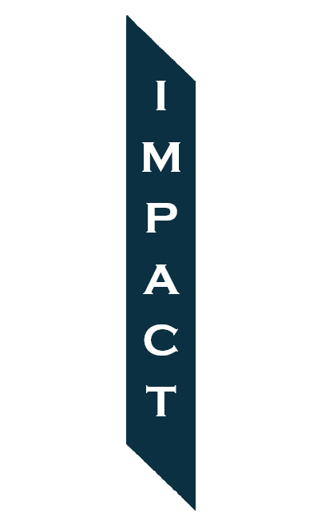

  

# Impaction

A C++ 2D Game Engine inspired from Hazel 2D built for learning, experimentation and long-term graphics programming development.

## Current Project Status

**Development:** Impaction is currently in its first half with the fundamentals of the engine set up and working.

**Graphics API:** OpenGL.

**Language:** C++.

**Dialect:** C++ 17 (ISO/IEC 14882:2017).

**Platform:** Only available on Windows.

**License:** [License](LICENSE)

## Overview

### What is Impaction?

Impaction is a 2D Game Engine that can be used to create 2D indie games or any other custom 2D application without having to deal with graphics at the low level.

### Why Does Impaction Exist?

Mainly inspired from the Hazel2D engine, Impaction seeks to aid game developers in creating fast, responsive and visually pleasing 2D games without having to deal with graphics APIs, rendering concepts and user interfaces from scratch.

### What is Impaction's Future?

The developers on Impaction desire to create an Industry Grade 2D engine. Therefore, this project may continue for many years to come. It is because of this that any 3D system may never be implemented keeping to the originality of the idea. Contributions from anyone, if helpful will be accepted with gratitude.

### What is Impaction Currently Capable of?

In its early development stage, Impaction has a long time before it can stand up to our ideals. Nevertheless, currently it is still capable of basic rendering with shaders, textures, blending and cameras.

## Getting Started

### Requirements

*Note: Currently, Impaction only works on Windows.*

To build a game or 2D software using Impaction, using Visual Studio is highly recomended.
VS Code is generally not the recommended choice as it is not as much of a robust C++ IDE.

The [premake](premake5.lua), [EntryPoint.h](Impaction/src/Impaction/EntryPoint.h) and [Core.h](Impaction/src/Impaction/Core.h) must be edited accordingly whilst experimenting usage with other Operating Systems.

### Cloning

**1. Downloading the Repository:**
Make sure git is installed. Open command prompt or git bash at the desired directory. If opened at `C:\Users\{Name}` then use `cd "{Desired-Directory}"` to reach there. Clone the repository with
`git clone --recursive https://github.com/ethereal2013/Impaction.git`.

If the repository was previously cloned non-recursively, use `git submodule update --init` to clone the necessary submodules.

**2. Regenerating the project:**
If changes are made, make sure to update and save the [premake](premake5.lua) as necessary and then run the [GenerateProject.bat](GenerateProject.bat) to regenerate and reload the project before compilation.

## Inspiration and Acknowledgements

Impaction is heavily inspired by Hazel2D, the game engine developed by The Cherno.

Its initial architecture and implementation closely follow Hazel as the project began primarily as a learning opportunity and as a first serious attempt at developing a game engine.

At its current stage, the project closely resembles Hazel's architecture and implementation. This is intentional and shows the project's educational origin rather than an attempt to present the initial implementation as an independently designed game engine.

As development progresses, Impaction is intended to evolve beyond its initial reference implementation i.e. Hazel2D. Soon having independently designed systems, experiments, architectural changes, and features introduced over time.

## Contact Us

If you are interested in Impaction, game engine development, graphics programming, or simply want to follow the project's progress, feel free to join our community.

[Our Discord](https://discord.gg/mVgNpnuTCY)

## Contributing

Impaction is a long-term project, and contributions, suggestions, bug reports, and discussions are always welcome. Whether you are interested in improving the engine, experimenting with new systems, or simply exploring the codebase, you are welcome to participate.

As Impaction continues to develop, this repository will evolve alongside it. We hope that the project can serve not only as an engine, but also as a place to experiment, learn, and explore the foundations of game and graphics programming.
